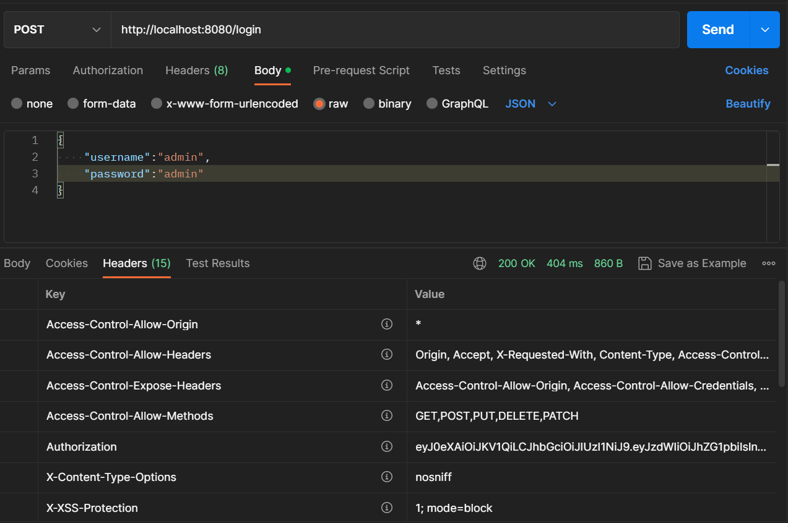
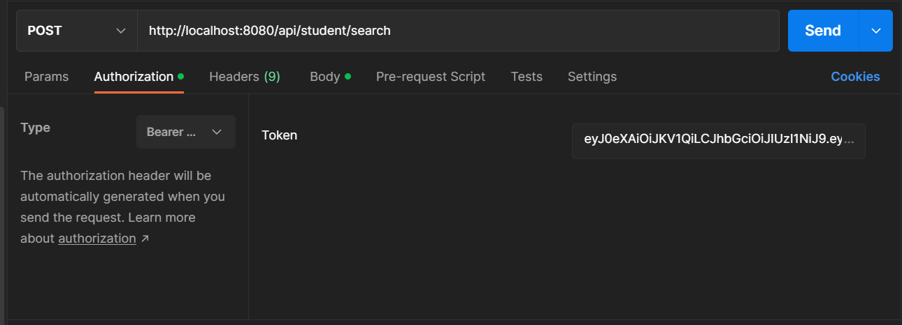
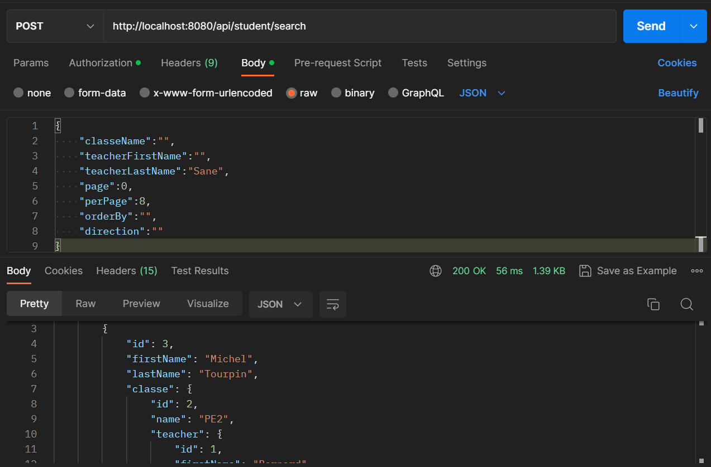

<!-- PROJECT LOGO -->
<br />
<div align="center">

<h3 align="center">Java-Spring-Security-Test</h3>

  <p align="center">
    C'est un projet de Gestion scolaire
<br />
</div>


<!-- ABOUT THE PROJECT -->

## A propos du project

C'est un projet de Gestion scolaire concernant les éléves et le personnel enseignant
Il permet entre autre d'avoir 

* Creation , Suppression , Modification , Liste  d'un enseignant
* Creation , Suppression , Modification , Liste et la recherche d'un etudiant
* Creation , Suppression , Modification , Liste d'une classe
* Creation , Authentification d'une personne 


<p align="right">(<a href="#readme-top">back to top</a>)</p>

### EXECUTION

Pour lancer le projet il faut executer la commande:
* mvn
  ```sh
  mvn spring-boot:run
  ```
* [![Spring-Boot][Spring-Boot.io]][Spring-Boot-url]
* [![Postgres][postgresql.org]][postgresql-url]
* [![Java][java.com]][java-url]

### USAGE
Connection d'un utilisateur 
 ```sh
  username:admin 
  password:admin
  ```



Ajout du token recu de la part du server backend



Recuperation des resultats de recherche aprés authentification 



<p align="right">(<a href="#readme-top">back to top</a>)</p>


<!-- GETTING STARTED -->


## WEBOGRAPHIE


* [https://www.baeldung.com/database-migrations-with-flyway](https://www.baeldung.com/database-migrations-with-flyway)
* [https://flywaydb.org/documentation/usage/plugins/springboot](https://flywaydb.org/documentation/usage/plugins/springboot)
* [https://mapstruct.org/](https://mapstruct.org/)
* [https://dev.to/envoy_/150-badges-for-github-pnk](https://dev.to/envoy_/150-badges-for-github-pnk)


[Spring-Boot-url]:https://spring.io

[Spring-Boot.io]:https://img.shields.io/badge/Spring-6DB33F?style=for-the-badge&logo=spring&logoColor=white

[Java-url]:https://java.com

[java.com]:https://img.shields.io/badge/Java-ED8B00?style=for-the-badge&logo=openjdk&logoColor=white

[postgresql-url]:https://postgresql.org

[postgresql.org]:https://img.shields.io/badge/PostgreSQL-316192?style=for-the-badge&logo=postgresql&logoColor=white